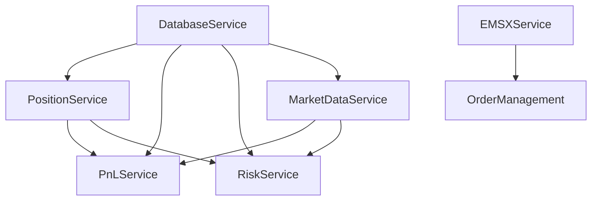

> 📖 [Back to Documentation Index](index.md)

# PMT Web Application: Server-Side Onboarding Guide

This guide provides step-by-step instructions for connecting the Reflex web application to MS SQL Server and implementing real server-side functionality to replace mock data.

## Table of Contents

1. [Prerequisites](#prerequisites)
2. [Database Setup](#database-setup)
3. [Environment Configuration](#environment-configuration)
4. [Service Layer Architecture](#service-layer-architecture)
5. [Code Reuse Strategy](#code-reuse-strategy)
6. [Implementation Guide](#implementation-guide)
7. [Using Services in Reflex States](#using-services-in-reflex-states)
8. [Service Class Reference](#service-class-reference)
9. [Troubleshooting](#troubleshooting)

---

## Prerequisites

### Required Software

- **Python 3.11+**: The project uses Python 3.11 or higher
- **MS SQL Server**: Access to a Microsoft SQL Server instance
- **UV Package Manager**: Already set up in this project
- **Bloomberg Terminal** (Optional): Required only if using Bloomberg EMSX/market data services

### Required Python Packages

The following dependencies will be added to `pyproject.toml`:

- `pyodbc` or `pymssql`: MS SQL Server database driver
- `python-dotenv`: Environment variable management
- `pandas`: Data processing (likely already installed)

---

## Database Setup

### 1. MS SQL Server Connection

#### Connection Methods

**Option A: Using pyodbc (Recommended for Windows)**

```python
import pyodbc

# Connection string format
server = 'your_server_name'
database = 'your_database_name'
username = 'your_username'
password = 'your_password'

conn_str = (
    f'DRIVER={{ODBC Driver 17 for SQL Server}};'
    f'SERVER={server};'
    f'DATABASE={database};'
    f'UID={username};'
    f'PWD={password}'
)

connection = pyodbc.connect(conn_str)
```

**Option B: Using Windows Authentication**

```python
conn_str = (
    f'DRIVER={{ODBC Driver 17 for SQL Server}};'
    f'SERVER={server};'
    f'DATABASE={database};'
    f'Trusted_Connection=yes;'
)
```

### 2. Database Schema

Based on the PyQt application architecture documented in [pmt.md](file:///C:/Users/orkap/Desktop/Programming/Portfolio-Management-Tool/docs/pmt.md), your database should contain tables for:

#### Core Tables

- **Positions**: `position_full`, `position_eod_*`, Stock/Warrant/Bond position tables
- **PnL**: P&L change, summary, and currency tables
- **Market Data**: Real-time and historical market data tables
- **Orders**: EMSX order and route tables
- **Compliance**: Restricted list, undertaking, beneficial ownership
- **Risk**: Risk measures, delta changes, risk input tables
- **Events**: Event calendar, event stream tables
- **Operations**: Daily procedures, process monitoring
- **Reconciliation**: PPS recon, settlement recon, failed trades

#### Query Configuration

The PyQt app stores SQL queries in `.report.ini` files under `resources/config/report/`. These queries can be reused in the web app. See the [Code Reuse Strategy](#code-reuse-strategy) section.

---

## Environment Configuration

### 1. Create `.env` File

Create a `.env` file in the project root directory:

```bash
# Database Configuration
DB_SERVER=your_server_name.database.windows.net
DB_NAME=portfolio_management
DB_USERNAME=your_username
DB_PASSWORD=your_secure_password
DB_DRIVER=ODBC Driver 17 for SQL Server

# Bloomberg Configuration (Optional)
BBG_HOST=localhost
BBG_PORT=8194
BBG_EMSX_ENABLED=false

# Application Settings
LOG_LEVEL=INFO
LOG_PATH=./logs
ENVIRONMENT=development

# API Keys (if needed)
MARKET_DATA_API_KEY=your_api_key_here
```

### 2. Security Best Practices

> [!CAUTION]
> **Never commit `.env` to version control!** The `.env` file contains sensitive credentials.

Ensure `.env` is in `.gitignore`:

```bash
# Check if .env is ignored
git check-ignore .env
```

### 3. Loading Environment Variables

The service classes will use `python-dotenv` to load configuration:

```python
from dotenv import load_dotenv
import os

load_dotenv()

db_server = os.getenv('DB_SERVER')
db_name = os.getenv('DB_NAME')
```

---

## Service Layer Architecture

### Overview

The service layer follows a clean architecture pattern, separating data access from business logic and UI concerns:

```
┌─────────────────────────────────────────────────────┐
│                  Reflex UI Layer                    │
│            (States, Pages, Components)              │
└─────────────────┬───────────────────────────────────┘
                  │
                  ▼
┌─────────────────────────────────────────────────────┐
│                Service Layer (New)                  │
│  - DatabaseService                                  │
│  - MarketDataService                                │
│  - PositionService                                  │
│  - PnLService                                       │
│  - RiskService                                      │
│  - EMSXService                                      │
└─────────────────┬───────────────────────────────────┘
                  │
                  ▼
┌─────────────────────────────────────────────────────┐
│         PyQt Business Logic (Reusable)              │
│     source/reports/*, source/utilities/*            │
│     - Data extractors                               │
│     - Calculators                                   │
│     - Query builders                                │
└─────────────────────────────────────────────────────┘
```

### Service Class Design

Each service class follows this pattern:

```python
class ServiceName:
    \"\"\"Service for handling X data operations.\"\"\"
    
    def __init__(self, db_service: DatabaseService):
        self.db = db_service
    
    async def get_data(self, params: dict) -> list[dict]:
        \"\"\"Fetch data from database or external service.\"\"\"
        # Implementation here
        pass
    
    def _process_data(self, raw_data: list) -> list[dict]:
        \"\"\"Transform raw data to UI-ready format.\"\"\"
        # Implementation here
        pass
```

### Service Dependencies



---

## Code Reuse Strategy

### Integration with PyQt Codebase

Following the guidance in [pmt_web_plan.md](file:///C:/Users/orkap/Desktop/Programming/Portfolio-Management-Tool/docs/pmt_web_plan.md), you can reuse business logic from the PyQt application:

### 1. Shared Configuration

The PyQt app uses `.report.ini` files in `resources/config/report/` for:
- SQL queries
- Data model definitions (field types, labels, formats)
- Column configurations
- Merge rules
- Validation rules

**Reuse Strategy**: Read these `.ini` files using the existing config readers:

```python
from source.utilities.config_reader_model import read_model_config
from source.utilities.config_reader_env import read_env_config

# Load report configuration
report_config = read_model_config("market_data_tab/market_data.report.ini")
sql_query = report_config.query
columns = report_config.data_model_header
```

### 2. Data Extractors

The PyQt app has data extraction logic in `source/reports/*/`:

- `*_extractor.py`: Database query builders
- `*_calculator.py`: Business logic calculations
- `shared_data.py`: Common data utilities

**Reuse Strategy**: Import and call these functions from your service layer:

```python
from source.reports.position_tab.position_full.position_extractor import extract_current_positions
from source.utilities.database_reader import execute_query

async def get_positions(self, position_date: str) -> pd.DataFrame:
    \"\"\"Fetch positions using PyQt extractor logic.\"\"\"
    positions_df = await asyncio.to_thread(
        extract_current_positions,
        position_date=position_date
    )
    return positions_df
```

### 3. Database Access

Reuse the existing database utilities:

```python
from source.utilities.database_reader import execute_query
from source.utilities.config_database_query import get_query_by_name

# Execute a named query from config
df = execute_query(report_type="position_full", query_name="get_positions")
```

### 4. Report Class System

The PyQt app uses a `ReportClass` system with:

- `source/models/class_mapping.py`: Maps report types to classes
- `source/models/class_report.py`: Base report class
- `source/reports/*/`: Specific report implementations

**Reuse Strategy**: Instantiate and use report classes:

```python
from source.models.class_mapping import ReportType, get_report_class

# Get the position report class
PositionClass = get_report_class(ReportType.position_full)
position_report = PositionClass()

# Extract data using the report class
data_df = position_report.extract_report_data()
```

### 5. Implementation Pattern

For maximum code reuse, follow this pattern:

```python
# app/services/position_service.py
import asyncio
from source.reports.position_tab.position_full.position_full_class import PositionFull

class PositionService:
    def __init__(self):
        self.position_report = PositionFull()
    
    async def get_positions(self, position_date: str = None) -> list[dict]:
        \"\"\"Get positions using PyQt report class.\"\"\"
        
        # Set parameters if needed
        if position_date:
            self.position_report.report_params['position_date'] = position_date
        
        # Extract data using existing PyQt logic
        df = await asyncio.to_thread(
            self.position_report.extract_report_data
        )
        
        # Convert DataFrame to list of dicts for Reflex
        return df.to_dict('records')
```

---

## Implementation Guide

### Step 1: Install Dependencies

```bash
cd C:\Users\orkap\Desktop\Programming\Portfolio-Management-Tool

# Add dependencies to project
uv add pyodbc python-dotenv pandas
```

### Step 2: Configure Environment

1. Copy `.env.example` to `.env`
2. Fill in your actual database credentials
3. Test database connection:

```bash
uv run python -c "from app.services.database_service import DatabaseService; db = DatabaseService(); db.test_connection()"
```

### Step 3: Implement Service Methods

Each service file has mock implementations. Replace them with real logic:

#### Example: Position Service

```python
# app/services/position_service.py

async def get_positions(self, position_date: str = None) -> list[dict]:
    \"\"\"Fetch real position data from database.\"\"\"
    
    # Option 1: Use PyQt report class (recommended)
    from source.reports.position_tab.position_full.position_full_class import PositionFull
    report = PositionFull()
    if position_date:
        report.report_params['position_date'] = position_date
    df = await asyncio.to_thread(report.extract_report_data)
    return df.to_dict('records')
    
    # Option 2: Direct SQL query
    query = \"\"\"
        SELECT 
            trade_date, deal_num, ticker, company_name,
            sec_type, account_id, position_location, notional
        FROM positions
        WHERE trade_date = ?
    \"\"\"
    df = await self.db.execute_query(query, [position_date])
    return df.to_dict('records')
```

### Step 4: Update State Files

Replace mock data calls in state files with service calls:

```python
# app/states/dashboard/portfolio_dashboard_state.py

from app.services.position_service import PositionService

class PortfolioDashboardState(rx.State):
    positions: list[PositionItem] = []
    
    async def load_positions(self):
        \"\"\"Load real positions from database.\"\"\"
        position_service = PositionService()
        self.positions = await position_service.get_positions()
```

### Step 5: Handle Bloomberg EMSX (Optional)

If using Bloomberg services, you can reuse the PyQt Bloomberg integration:

```python
from source.bloomberg.bbg_service_connector import BBGServiceConnector
from source.bloomberg.service.emsx_order import get_emsx_orders

async def get_emsx_orders(self) -> list[dict]:
    \"\"\"Fetch EMSX orders from Bloomberg.\"\"\"
    connector = BBGServiceConnector()
    orders = await asyncio.to_thread(get_emsx_orders, connector)
    return orders
```

---

## Using Services in Reflex States

This section explains how to use the service layer from Reflex state classes, following Reflex best practices for async event handlers, loading states, and error handling.

### Why Use Services in States?

**Separation of Concerns**:
- **States**: Manage UI state and user interactions
- **Services**: Handle data fetching and business logic
- **Result**: Cleaner, more maintainable code

**Benefits**:
- Easy to test (mock services for testing)
- Gradual migration (start with mock services, swap for real DB later)
- Code reuse (share services across multiple states)
- Better error handling (centralized in services)

###  Basic Async State Pattern

Every state that fetches data should follow this pattern:

```python
import reflex as rx
from app.services import SomeService

class FeatureState(rx.State):
    # Data
    items: list[dict] = []
    
    # UI State
    is_loading: bool = False
    error: str = ""
    
    # Lifecycle - called when page loads
    async def on_load(self):
        \"\"\"Automatically called when component mounts.\"\"\"
        await self.load_data()
    
    # Data Loading
    async def load_data(self):
        \"\"\"Fetch data from service.\"\"\"
        self.is_loading = True
        self.error = ""
        
        try:
            service = SomeService()
            self.items = await service.get_items()
        except Exception as e:
            self.error = f"Failed to load data: {str(e)}"
        finally:
            self.is_loading = False
    
    # Actions
    async def refresh(self):
        \"\"\"Refresh button handler.\"\"\"
        await self.load_data()
```

### Real-World Example: Dashboard State

Here's how to refactor `dashboard_state.py` to use services:

**Before (Mock Data)**:
```python
# app/states/dashboard/dashboard_state.py
import reflex as rx

class DashboardState(rx.State):
    holdings: list[dict] = [
        {"symbol": "AAPL", "shares": 150, "price": 189.5},
        {"symbol": "MSFT", "shares": 100, "price": 402.1},
        # ... hardcoded mock data
    ]
```

**After (Using Service)**:
```python
# app/states/dashboard/dashboard_state.py
import reflex as rx
from app.services import PositionService

class DashboardState(rx.State):
    # Data
    holdings: list[dict] = []
    
    # UI State  
    is_loading: bool = False
    error: str = ""
    
    # Lifecycle
    async def on_load(self):
        \"\"\"Load holdings when page loads.\"\"\"
        await self.load_holdings()
    
    # Data Loading
    async def load_holdings(self):
        \"\"\"Fetch holdings from service.\"\"\"
        self.is_loading = True
        self.error = ""
        
        try:
            service = PositionService()
            positions = await service.get_positions()
            
            # Transform to holdings format
            self.holdings = [
                {
                    "symbol": p["ticker"],
                    "shares": p.get("quantity", 0),
                    "price": p.get("current_price", 0),
                    # ... other fields
                }
                for p in positions
            ]
        except Exception as e:
            self.error = f"Failed to load holdings: {str(e)}"
        finally:
            self.is_loading = False
    
    # Actions
    async def refresh_holdings(self):
        \"\"\"Refresh button handler.\"\"\"
        await self.load_holdings()
```

### Pattern: Multiple Data Sources

When a state needs data from multiple services:

```python
import reflex as rx
from app.services import MarketDataService, PnLService, RiskService

class PortfolioDashboardState(rx.State):
    # Data for different tabs
    market_data_items: list[dict] = []
    pnl_items: list[dict] = []
    risk_items: list[dict] = []
    
    # Active tab
    active_tab: str = "market_data"
    
    # UI State
    is_loading: bool = False
    error: str = ""
    
    async def on_load(self):
        \"\"\"Load data for the active tab on mount.\"\"\"
        await self.load_tab_data()
    
    async def load_tab_data(self):
        \"\"\"Load data based on active tab.\"\"\"
        self.is_loading = True
        self.error = ""
        
        try:
            if self.active_tab == "market_data":
                service = MarketDataService()
                tickers = ["AAPL", "MSFT", "GOOGL"]
                self.market_data_items = await service.get_realtime_market_data(tickers)
                
            elif self.active_tab == "pnl":
                service = PnLService()
                self.pnl_items = await service.get_pnl_changes()
                
            elif self.active_tab == "risk":
                service = RiskService()
                self.risk_items = await service.get_delta_changes()
                
        except Exception as e:
            self.error = f"Failed to load {self.active_tab} data: {str(e)}"
        finally:
            self.is_loading = False
    
    def set_active_tab(self, tab: str):
        \"\"\"Change tab and load its data.\"\"\"
        self.active_tab = tab
        # Note: we need to return a generator for async
        return self.load_tab_data
```

### Pattern: Computed Vars with Service Data

Use `@rx.var` for derived data:

```python
import reflex as rx
from app.services import PositionService

class PortfolioState(rx.State):
    holdings: list[dict] = []
    is_loading: bool = False
    
    @rx.var
    def total_value(self) -> float:
        \"\"\"Computed: Total portfolio value.\"\"\"
        return sum(h["shares"] * h["current_price"] for h in self.holdings)
    
    @rx.var
    def top_performers(self) -> list[dict]:
        \"\"\"Computed: Top 3 gainers.\"\"\"
        sorted_holdings = sorted(
            self.holdings,
            key=lambda x: x.get("daily_change_pct", 0),
            reverse=True
        )
        return sorted_holdings[:3]
    
    async def on_load(self):
        await self.load_holdings()
    
    async def load_holdings(self):
        self.is_loading = True
        try:
            service = PositionService()
            self.holdings = await service.get_positions()
        finally:
            self.is_loading = False
```

### Pattern: Using `asyncio.to_thread` for Sync Code

If the PyQt business logic is synchronous, use `asyncio.to_thread`:

```python
import asyncio
import reflex as rx
from source.reports.position_tab.position_full.position_full_class import PositionFull

class PositionState(rx.State):
    positions: list[dict] = []
    is_loading: bool = False
    
    async def load_positions(self, position_date: str = None):
        \"\"\"Load positions using sync PyQt logic.\"\"\"
        self.is_loading = True
        
        try:
            # PositionFull().extract_report_data() is SYNC
            # Use asyncio.to_thread to run it without blocking
            report = PositionFull()
            if position_date:
                report.report_params['position_date'] = position_date
            
            # Run sync method in thread pool
            df = await asyncio.to_thread(report.extract_report_data)
            
            # Convert DataFrame to list of dicts
            self.positions = df.to_dict('records')
            
        except Exception as e:
            print(f"Error loading positions: {e}")
        finally:
            self.is_loading = False
```

### Pattern: Loading States and Error Handling

Always provide visual feedback for loading and errors:

```python
import reflex as rx
from app.services import NotificationService

class NotificationState(rx.State):
    notifications: list[dict] = []
    selected_category: str = "All"
    is_loading: bool = False
    error: str = ""
    
    async def load_notifications(self):
        \"\"\"Load notifications with loading state.\"\"\"
        self.is_loading = True
        self.error = ""
        
        try:
            service = NotificationService()
            self.notifications = await service.get_notifications(
                category=self.selected_category if self.selected_category != "All" else None
            )
        except Exception as e:
            self.error = f"Failed to load notifications: {str(e)}"
            # Optionally show toast
            return rx.toast.error(f"Error: {str(e)}")
        finally:
            self.is_loading = False
    
    def set_category(self, category: str):
        \"\"\"Change category filter.\"\"\"
        self.selected_category = category
        return self.load_notifications
```

**In the UI component**:
```python
def notification_page():
    return rx.cond(
        NotificationState.is_loading,
        rx.spinner(),  # Show spinner while loading
        rx.cond(
            NotificationState.error != "",
            rx.callout(
                NotificationState.error,
                icon="alert-circle",
                color="red"
            ),  # Show error if present
            rx.vstack(
                # Show data
                rx.foreach(
                    NotificationState.notifications,
                    notification_card
                )
            )
        )
    )
```

### Pattern: Background Refresh

Implement auto-refresh for real-time data:

```python
import reflex as rx
from app.services import MarketDataService

class MarketDataState(rx.State):
    market_data: list[dict] = []
    auto_refresh_enabled: bool = True
    is_loading: bool = False
    
    async def on_load(self):
        \"\"\"Initial load and start background refresh.\"\"\"
        await self.load_market_data()
        
        # Start background refresh if enabled
        if self.auto_refresh_enabled:
            return self.background_refresh
    
    async def load_market_data(self):
        \"\"\"Load market data from service.\"\"\"
        self.is_loading = True
        try:
            service = MarketDataService()
            tickers = ["AAPL", "MSFT", "GOOGL", "TSLA"]
            self.market_data = await service.get_realtime_market_data(tickers)
        finally:
            self.is_loading = False
    
    async def background_refresh(self):
        \"\"\"Background task for auto-refresh.\"\"\"
        while self.auto_refresh_enabled:
            await asyncio.sleep(30)  # Refresh every 30 seconds
            await self.load_market_data()
            
    def toggle_auto_refresh(self):
        \"\"\"Toggle auto-refresh on/off.\"\"\"
        self.auto_refresh_enabled = not self.auto_refresh_enabled
        if self.auto_refresh_enabled:
            return self.background_refresh
```

### Pattern: Accessing Other States

Use `get_state()` to access data from other states:

```python
import reflex as rx
from app.services import PnLService

class PortfolioState(rx.State):
    holdings: list[dict] = []

class PnLState(rx.State):
    pnl_data: list[dict] = []
    
    async def calculate_pnl(self):
        \"\"\"Calculate P&L using holdings from PortfolioState.\"\"\"
        # Get holdings from another state
        portfolio_state = await self.get_state(PortfolioState)
        
        if not portfolio_state.holdings:
            self.pnl_data = []
            return
        
        # Calculate P&L with service
        service = PnLService()
        self.pnl_data = await service.get_pnl_changes()
```

### Complete Example: Notification State Refactoring

**Before (Inline Mock Data)**:
```python
# Old notification_state.py
class NotificationState(rx.State):
    notifications: list[Notification] = [
        {
            "id": "1",
            "category": "Alerts",
            "title": "AAPL Price Alert",
            ...
        },
        ...  # Hardcoded data
    ]
    
    def mark_all_read(self):
        self.notifications = [
            {**n, "is_read": True} for n in self.notifications
        ]
```

**After (Using Service)**:
```python
# New notification_state.py
import reflex as rx
from app.services import NotificationService

class NotificationState(rx.State):
    # Data
    notifications: list[dict] = []
    selected_category: str = "All"
    
    # UI State
    is_loading: bool = False
    error: str = ""
    
    @rx.var
    def unread_count(self) -> int:
        \"\"\"Computed: Count of unread notifications.\"\"\"
        return len([n for n in self.notifications if not n.get("is_read")])
    
    @rx.var
    def filtered_notifications(self) -> list[dict]:
        \"\"\"Computed: Filtered notifications by category.\"\"\"
        if self.selected_category == "All":
            return self.notifications
        return [
            n for n in self.notifications 
            if n.get("category") == self.selected_category
        ]
    
    # Lifecycle
    async def on_load(self):
        await self.load_notifications()
    
    # Data Loading
    async def load_notifications(self):
        \"\"\"Load notifications from service.\"\"\"
        self.is_loading = True
        self.error = ""
        
        try:
            service = NotificationService()
            self.notifications = await service.get_notifications()
        except Exception as e:
            self.error = str(e)
        finally:
            self.is_loading = False
    
    # Actions
    def set_category(self, category: str):
        \"\"\"Filter by category.\"\"\"
        self.selected_category = category
    
    async def mark_all_read(self):
        \"\"\"Mark all notifications as read.\"\"\"
        try:
            service = NotificationService()
            count = await service.mark_all_as_read(
                category=self.selected_category if self.selected_category != "All" else None
            )
            
            # Reload to get updated data
            await self.load_notifications()
            
            return rx.toast.success(f"Marked {count} notifications as read")
        except Exception as e:
            return rx.toast.error(f"Error: {str(e)}")
    
    async def clear_all(self):
        \"\"\"Clear all notifications.\"\"\"
        try:
            service = NotificationService()
            count = await service.delete_all(
                category=self.selected_category if self.selected_category != "All" else None
            )
            
            # Reload to get updated data
            await self.load_notifications()
            
            return rx.toast.success(f"Cleared {count} notifications")
        except Exception as e:
            return rx.toast.error(f"Error: {str(e)}")
```

### Best Practices

1. **Always Add Loading States**
   ```python
   is_loading: bool = False
   error: str = ""
   ```

2. **Use Try/Except for Error Handling**
   ```python
   try:
       data = await service.get_data()
   except Exception as e:
       self.error = str(e)
   ```

3. **Clear Errors Before New Requests**
   ```python
   async def load_data(self):
       self.error = ""  # Clear previous errors
       try:
           ...
   ```

4. **Use `finally` to Reset Loading State**
   ```python
   finally:
       self.is_loading = False
   ```

5. **Provide User Feedback**
   ```python
   return rx.toast.success("Data loaded successfully")
   ```

6. **Use Computed Vars for Derived Data**
   ```python
   @rx.var
   def total_value(self) -> float:
       return sum(...)
   ```

7. **Keep State Methods Focused**
   - One method = one responsibility
   - Separate loading, filtering, sorting into different methods

8. **Initialize Data on `on_load`**
   ```python
   async def on_load(self):
       await self.load_data()
   ```

---

## Service Class Reference

### DatabaseService

**Purpose**: Manages database connections and query execution

**Key Methods**:
- `get_connection()`: Get database connection
- `execute_query(query, params)`: Execute parameterized query
- `execute_stored_proc(proc_name, params)`: Execute stored procedure
- `test_connection()`: Verify database connectivity

### PositionService

**Purpose**: Fetch and process position data

**Key Methods**:
- `get_positions(date)`: Get all positions for a date
- `get_stock_positions(date)`: Get stock positions
- `get_warrant_positions(date)`: Get warrant positions
- `get_bond_positions(date)`: Get bond positions

**Data Source**: PyQt equivalent at `source/reports/position_tab/`

### PnLService

**Purpose**: Calculate and retrieve P&L metrics

**Key Methods**:
- `get_pnl_summary(date)`: Get P&L summary
- `get_pnl_changes(date, period)`: Get P&L changes over period
- `get_pnl_by_currency(date)`: Get currency-wise P&L

**Data Source**: PyQt equivalent at `source/reports/pnl_tab/`

### MarketDataService

**Purpose**: Fetch market data from Bloomberg or other providers

**Key Methods**:
- `get_realtime_data(tickers)`: Get real-time market data
- `get_historical_data(ticker, start, end)`: Get historical prices
- `get_fx_rates(currency_pairs)`: Get FX rates

**Data Source**: PyQt equivalent at `source/reports/market_data_tab/`

### RiskService

**Purpose**: Calculate risk metrics

**Key Methods**:
- `get_delta_changes(date)`: Get position deltas
- `get_risk_measures(date)`: Get risk metrics (Greeks)
- `get_gamma_exposure(date)`: Get gamma exposure

**Data Source**: PyQt equivalent at `source/pricers/` and `source/reports/analytics_tab/`

### EMSXService

**Purpose**: Interact with Bloomberg EMSX for order management

**Key Methods**:
- `get_emsx_orders()`: Get all EMSX orders
- `get_emsx_routes()`: Get EMSX routes
- `create_order(order_params)`: Create new EMSX order

**Data Source**: PyQt equivalent at `source/bloomberg/service/`

---

## Troubleshooting

### Database Connection Issues

#### Error: "Driver not found"

**Solution**: Install ODBC Driver for SQL Server

```bash
# Download from Microsoft:
# https://docs.microsoft.com/en-us/sql/connect/odbc/download-odbc-driver-for-sql-server

# Verify installed drivers
import pyodbc
print(pyodbc.drivers())
```

#### Error: "Login failed for user"

**Solutions**:
1. Verify credentials in `.env` file
2. Check SQL Server allows remote connections
3. Verify firewall rules allow connection on port 1433
4. Test connection using SQL Server Management Studio first

#### Error: "Connection timeout"

**Solutions**:
1. Verify server name is correct (include instance name if needed: `server\\instance`)
2. Check network connectivity to server
3. Increase connection timeout in connection string:
   ```python
   conn_str += ';Connection Timeout=30;'
   ```

### Import Errors from PyQt Code

#### Error: "No module named 'PyQt5'"

**Solution**: The service layer should not import PyQt5 UI code. Only import business logic modules.

```python
# ❌ BAD - Don't import UI modules
from source.gui.ui.ui_window_main import MainWindow

# ✅ GOOD - Import business logic only
from source.reports.position_tab.position_full.position_extractor import extract_positions
```

#### Error: "Config file not found"

**Solution**: Ensure `resources/config/` directory is accessible:

```python
import os
from pathlib import Path

# Get project root
PROJECT_ROOT = Path(__file__).parent.parent
CONFIG_PATH = PROJECT_ROOT / "resources" / "config" / "report"

# Verify path exists
if not CONFIG_PATH.exists():
    print(f"Config path not found: {CONFIG_PATH}")
```

### Bloomberg Connection Issues

#### Error: "Bloomberg terminal not running"

**Solutions**:
1. Ensure Bloomberg Terminal is logged in and running
2. Verify Bloomberg API is enabled
3. Check `BBG_HOST` and `BBG_PORT` in `.env` file

#### Error: "EMSX service unavailable"

**Solutions**:
1. Verify EMSX subscription is active
2. Check Bloomberg service status
3. Verify credentials have EMSX permissions

### Performance Issues

#### Slow Query Execution

**Solutions**:
1. Add database indexes on frequently queried columns
2. Use query caching for static data
3. Implement connection pooling:

```python
from sqlalchemy import create_engine
from sqlalchemy.pool import QueuePool

engine = create_engine(
    connection_string,
    poolclass=QueuePool,
    pool_size=5,
    max_overflow=10
)
```

#### Large Result Sets

**Solutions**:
1. Implement pagination in queries
2. Use server-side filtering
3. Add `TOP N` or `LIMIT` clauses to queries

---

## Next Steps

1. ✅ **Review this documentation**
2. ⬜ **Configure `.env` with your database credentials**
3. ⬜ **Test database connection using `DatabaseService.test_connection()`**
4. ⬜ **Implement one service at a time** (start with `PositionService`)
5. ⬜ **Update corresponding state files** to use real data
6. ⬜ **Test in browser** at http://localhost:3001
7. ⬜ **Iterate** through remaining services

---

## Additional Resources

- **PyQt Architecture**: See [pmt.md](file:///C:/Users/orkap/Desktop/Programming/Portfolio-Management-Tool/docs/pmt.md) for detailed PyQt app structure
- **Code Reuse Guide**: See [pmt_web_plan.md](file:///C:/Users/orkap/Desktop/Programming/Portfolio-Management-Tool/docs/pmt_web_plan.md) for shared logic patterns
- **MS SQL Server Docs**: https://docs.microsoft.com/en-us/sql/
- **pyodbc Documentation**: https://github.com/mkleehammer/pyodbc/wiki
- **Reflex Documentation**: https://reflex.dev/docs/

---

## Support

For questions or issues:
1. Check the [Troubleshooting](#troubleshooting) section above
2. Review the PyQt source code for examples: `source/reports/`, `source/utilities/`
3. Refer to configuration files: `resources/config/report/**/*.report.ini`

Good luck with your implementation! 🚀
