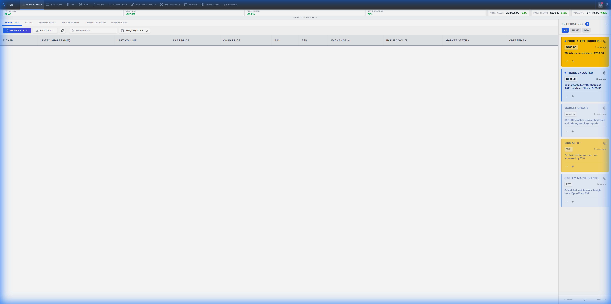
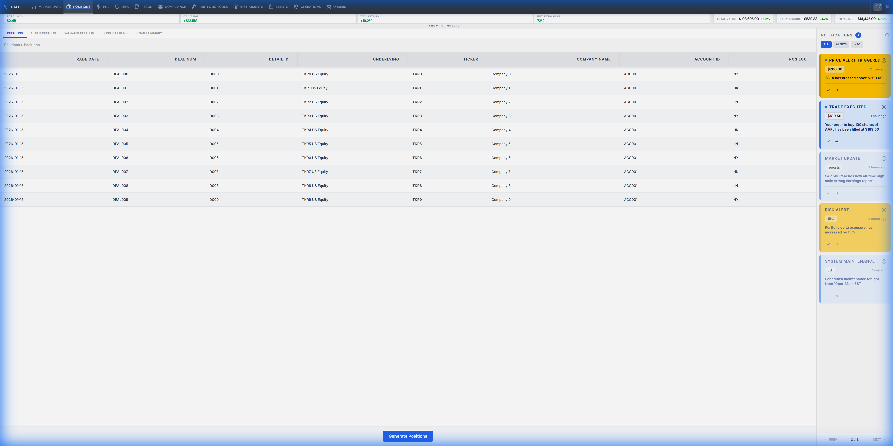

# Reflex Application Architecture Guide

A comprehensive reference for building scalable, maintainable Reflex applications. This guide covers layout architecture, state management patterns, service layer design, styling conventions, and component organization.

**Scope**: This guide is framework-focused and domain-agnostic. Adapt the patterns to your specific application context (e.g., e-commerce, dashboard, CRM, analytics platform, etc.).

---

## Table of Contents

1. [Getting Started](#1-getting-started)
2. [Project Structure](#2-project-structure)
3. [Multi-Region Layout Architecture](#3-multi-region-layout-architecture)
4. [State Management Patterns](#4-state-management-patterns)
5. [Service Layer Architecture](#5-service-layer-architecture)
6. [Component Organization](#6-component-organization)
7. [Styling and CSS Guidelines](#7-styling-and-css-guidelines)
8. [Reflex-Specific Best Practices](#8-reflex-specific-best-practices)
9. [Template Generation Framework](#9-template-generation-framework)
10. [Quick Reference Checklists](#10-quick-reference-checklists)

---

## 1. Getting Started

### 1.1 Running a Reflex Application

```bash
# Install dependencies
uv sync

# Run the application
uv run reflex run
```

**Default Access Points:**
- **Frontend**: http://localhost:3000 (configurable in `rxconfig.py`)
- **Backend**: http://localhost:8000 (configurable in `rxconfig.py`)

### 1.2 Configuration (`rxconfig.py`)

```python
import reflex as rx

config = rx.Config(
    app_name="app",
    plugins=[rx.plugins.TailwindV3Plugin()],  # Enable Tailwind CSS
    frontend_port=3000,
    backend_port=8000,
)
```

### 1.3 Application Verification Checklist

When analyzing or testing a Reflex application:

- [ ] **App Loads**: Navigate to frontend URL, verify main layout renders
- [ ] **Navigation Works**: Click through all navigation elements
- [ ] **State Updates**: Interact with UI, verify state changes reflect correctly
- [ ] **Data Loading**: Verify async data loads without errors
- [ ] **Responsive Design**: Test on different viewport sizes
- [ ] **Error Handling**: Verify graceful error handling and user feedback

---

## 2. Project Structure

### 2.1 Recommended Directory Structure

```
your-reflex-app/
├── app/
│   ├── app.py                      # Main application entry point
│   ├── constants.py                # Design tokens (colors, dimensions, fonts)
│   │
│   ├── components/                 # UI Components
│   │   ├── __init__.py
│   │   ├── shared/                 # Shared/layout components
│   │   │   ├── __init__.py
│   │   │   ├── navigation.py       # Main navigation component
│   │   │   ├── header.py           # App header/metrics
│   │   │   ├── sidebar.py          # Sidebar component
│   │   │   └── layout.py           # Page layout wrapper
│   │   │
│   │   └── {module}/               # Module-specific components
│   │       ├── __init__.py         # Re-exports public components
│   │       └── {module}_views.py   # Views, tables, cards, forms
│   │
│   ├── states/                     # State Management
│   │   ├── __init__.py
│   │   ├── types.py                # Shared TypedDict definitions
│   │   ├── ui/
│   │   │   └── ui_state.py         # Global UI state
│   │   │
│   │   └── {module}/               # Module-specific states
│   │       ├── __init__.py
│   │       ├── types.py            # Module TypedDict definitions
│   │       ├── {module}_state.py   # Main module state
│   │       └── mixins/             # Reusable state logic
│   │           └── {feature}_mixin.py
│   │
│   ├── services/                   # Business Logic Layer
│   │   ├── __init__.py             # Service exports
│   │   ├── shared/
│   │   │   └── database_service.py # Database connectivity
│   │   │
│   │   └── {module}/
│   │       ├── __init__.py
│   │       └── {module}_service.py # Module business logic
│   │
│   └── pages/                      # Page Components (for routing)
│       └── {module}/
│           └── {page}_page.py
│
├── rxconfig.py                     # Reflex configuration
├── pyproject.toml                  # Dependencies
└── README.md
```

### 2.2 Key File Responsibilities

| File/Directory | Responsibility |
|----------------|----------------|
| `app.py` | App initialization, route registration, theme configuration |
| `constants.py` | Design tokens (colors, dimensions, fonts) |
| `components/shared/` | Layout components used across the entire application |
| `components/{module}/` | Module-specific UI components |
| `states/ui/` | Global UI state (navigation, sidebar, theme, notifications) |
| `states/{module}/` | Module-specific state and data management |
| `services/{module}/` | Business logic, API calls, data processing |
| `pages/{module}/` | Page-level components for route definitions |

---

## 3. Multi-Region Layout Architecture

### 3.1 Layout Concept



A well-structured application uses a multi-region layout for consistent user experience:

```
+------------------------------------------------------------------+
|                      REGION 1: Navigation                         |
|  [Logo] [Nav Item 1] [Nav Item 2] [Nav Item 3] ... [User Menu]   |
+------------------------------------------------------------------+
|                      REGION 2: Header (Optional)                  |
|  [Metrics/KPIs] [Breadcrumbs] [Quick Actions]                    |
+------------------------------------------------------------------+
|                                                    |   REGION 4   |
|              REGION 3: Main Content Area           |   Sidebar    |
|  [Tab Bar / Sub-navigation]                       |  (Optional)  |
|  [Toolbar / Filters / Actions]                    |              |
|  +----------------------------------------------+ | [Widget 1]   |
|  |                                              | | [Widget 2]   |
|  |           Primary Content                    | |              |
|  |    (Tables, Forms, Cards, Charts, etc.)      | |              |
|  +----------------------------------------------+ |              |
+------------------------------------------------------------------+
```

### 3.2 Region Definitions

| Region | Purpose | Typical Height | Position |
|--------|---------|----------------|----------|
| Region 1 | Navigation | 40-60px | Fixed top |
| Region 2 | Header/Metrics | 40-80px | Below nav (optional, can be collapsible) |
| Region 3 | Main Content | Flex (remaining) | Center, scrollable |
| Region 4 | Sidebar | Full height | Right/Left side (optional, collapsible) |

### 3.3 Layout Implementation

```python
# app/app.py
from app.components.shared.navigation import navigation
from app.components.shared.header import header
from app.components.shared.sidebar import sidebar

def index() -> rx.Component:
    return rx.el.div(
        navigation(),           # Region 1
        header(),               # Region 2 (optional)
        rx.el.div(
            main_content(),     # Region 3
            sidebar(),          # Region 4 (optional)
            class_name="flex flex-1 overflow-hidden min-h-0",
        ),
        class_name="flex flex-col h-screen w-screen overflow-hidden",
    )
```

### 3.4 Region 1: Navigation Component

```python
# app/components/shared/navigation.py
import reflex as rx
from app.states.ui.ui_state import UIState

def nav_item(name: str, icon: str, route: str) -> rx.Component:
    is_active = UIState.active_module == name
    return rx.link(
        rx.el.button(
            rx.icon(icon, size=16, class_name=rx.cond(is_active, "text-white", "text-gray-400")),
            rx.el.span(name, class_name="text-sm ml-2 hidden md:inline"),
            class_name=rx.cond(
                is_active,
                "flex items-center px-3 py-2 bg-blue-600 rounded-md",
                "flex items-center px-3 py-2 hover:bg-gray-700 rounded-md transition-colors",
            ),
        ),
        href=route,
    )

def navigation() -> rx.Component:
    return rx.el.nav(
        rx.el.div(
            # Logo/Brand
            rx.el.div(
                rx.icon("box", size=24, class_name="text-blue-500"),
                rx.el.span("App Name", class_name="font-bold text-lg ml-2 text-white"),
                class_name="flex items-center",
            ),
            # Navigation Items
            rx.el.div(
                nav_item("Dashboard", "layout-dashboard", "/"),
                nav_item("Module 1", "folder", "/module-1"),
                nav_item("Module 2", "users", "/module-2"),
                nav_item("Settings", "settings", "/settings"),
                class_name="flex items-center gap-1 ml-8",
            ),
            # Right side actions
            rx.el.div(
                rx.el.button(
                    rx.icon("bell", size=18),
                    on_click=UIState.toggle_sidebar,
                    class_name="p-2 hover:bg-gray-700 rounded-md transition-colors",
                ),
                rx.el.button(
                    rx.icon("user", size=18),
                    class_name="p-2 hover:bg-gray-700 rounded-md transition-colors ml-2",
                ),
                class_name="flex items-center ml-auto text-gray-300",
            ),
            class_name="flex items-center w-full px-4",
        ),
        class_name="h-[56px] bg-gray-900 text-white flex items-center shrink-0",
    )
```

### 3.5 Region 2: Header Component (Optional)

```python
# app/components/shared/header.py
import reflex as rx
from app.states.ui.ui_state import UIState

def metric_card(label: str, value: str, change: str, is_positive: bool) -> rx.Component:
    change_color = rx.cond(is_positive, "text-green-600", "text-red-600")
    return rx.el.div(
        rx.el.span(label, class_name="text-xs text-gray-500 uppercase tracking-wide"),
        rx.el.div(
            rx.el.span(value, class_name="text-xl font-bold text-gray-900"),
            rx.el.span(change, class_name=f"text-sm ml-2 {change_color}"),
            class_name="flex items-baseline",
        ),
        class_name="bg-white px-4 py-3 rounded-lg shadow-sm border",
    )

def header() -> rx.Component:
    return rx.el.div(
        rx.el.div(
            # Metrics (example - bind to your state)
            metric_card("Total Users", "12,345", "+12%", True),
            metric_card("Revenue", "$45,678", "+8%", True),
            metric_card("Active", "1,234", "-3%", False),
            class_name="flex gap-4",
        ),
        class_name="px-6 py-4 bg-gray-50 border-b shrink-0",
    )
```

### 3.6 Region 3: Main Content Area

```python
# app/components/shared/layout.py
import reflex as rx
from app.states.ui.ui_state import UIState

def tab_bar(tabs: list[str], active_tab: str, on_select) -> rx.Component:
    return rx.el.div(
        rx.foreach(
            tabs,
            lambda tab: rx.el.button(
                tab,
                on_click=lambda t=tab: on_select(t),
                class_name=rx.cond(
                    active_tab == tab,
                    "px-4 py-2 text-sm font-medium border-b-2 border-blue-600 text-blue-600",
                    "px-4 py-2 text-sm font-medium border-b-2 border-transparent text-gray-500 hover:text-gray-700",
                ),
            ),
        ),
        class_name="flex border-b bg-white px-4",
    )

def toolbar() -> rx.Component:
    return rx.el.div(
        rx.el.div(
            rx.icon("search", size=16, class_name="text-gray-400"),
            rx.el.input(
                placeholder="Search...",
                class_name="ml-2 bg-transparent outline-none text-sm w-48",
            ),
            class_name="flex items-center bg-white border rounded-md px-3 py-2",
        ),
        rx.el.div(
            rx.el.button("Filter", class_name="px-3 py-2 text-sm border rounded-md hover:bg-gray-50"),
            rx.el.button("Export", class_name="px-3 py-2 text-sm border rounded-md hover:bg-gray-50 ml-2"),
            rx.el.button("+ New", class_name="px-3 py-2 text-sm bg-blue-600 text-white rounded-md hover:bg-blue-700 ml-2"),
            class_name="flex items-center",
        ),
        class_name="flex items-center justify-between px-4 py-3 bg-gray-50 border-b",
    )

def page_layout(content: rx.Component, tabs: list[str] = None) -> rx.Component:
    return rx.el.div(
        rx.cond(tabs is not None, tab_bar(tabs, UIState.active_tab, UIState.set_tab)),
        toolbar(),
        rx.el.div(
            content,
            class_name="flex-1 overflow-auto p-4",
        ),
        class_name="flex flex-col flex-1 min-h-0 bg-white",
    )
```

### 3.7 Region 4: Sidebar Component (Optional)

```python
# app/components/shared/sidebar.py
import reflex as rx
from app.states.ui.ui_state import UIState

def sidebar_widget(title: str, content: rx.Component) -> rx.Component:
    return rx.el.div(
        rx.el.h4(title, class_name="text-sm font-semibold text-gray-700 mb-3"),
        content,
        class_name="bg-white p-4 rounded-lg border mb-4",
    )

def sidebar() -> rx.Component:
    return rx.cond(
        UIState.is_sidebar_open,
        rx.el.aside(
            rx.el.div(
                rx.el.h3("Sidebar", class_name="font-bold text-gray-800"),
                rx.el.button(
                    rx.icon("x", size=18),
                    on_click=UIState.toggle_sidebar,
                    class_name="p-1 hover:bg-gray-100 rounded",
                ),
                class_name="flex justify-between items-center p-4 border-b",
            ),
            rx.el.div(
                sidebar_widget("Widget 1", rx.el.p("Content here")),
                sidebar_widget("Widget 2", rx.el.p("More content")),
                class_name="p-4 flex-1 overflow-y-auto",
            ),
            class_name="w-[300px] bg-gray-50 border-l flex flex-col shrink-0",
        ),
    )
```

---

## 4. State Management Patterns

### 4.1 Core Principles

1. **Flat State Structure**: States inherit directly from `rx.State`, avoiding deep hierarchies
2. **Separation of Concerns**: One state class per feature/module
3. **Service Delegation**: States delegate business logic to services
4. **Mixin Pattern**: Reusable state logic via Python mixins

### 4.2 Global UI State

```python
# app/states/ui/ui_state.py
import reflex as rx
from typing import Dict, List

class UIState(rx.State):
    """Global UI state for navigation, sidebar, and app-wide settings."""
    
    # Navigation
    active_module: str = "Dashboard"
    _active_tabs: Dict[str, str] = {}
    
    # UI toggles
    is_sidebar_open: bool = True
    is_mobile_menu_open: bool = False
    theme: str = "light"
    
    # Notifications (example)
    notifications: List[dict] = []
    
    # Module configuration
    MODULE_TABS: Dict[str, List[str]] = {
        "Dashboard": ["Overview", "Analytics", "Reports"],
        "Module1": ["List", "Details", "Settings"],
        "Module2": ["Tab A", "Tab B"],
    }
    
    @rx.var
    def current_tabs(self) -> List[str]:
        """Returns tabs for the active module."""
        return self.MODULE_TABS.get(self.active_module, [])
    
    @rx.var
    def active_tab(self) -> str:
        """Returns active tab for current module."""
        tabs = self.current_tabs
        return self._active_tabs.get(self.active_module, tabs[0] if tabs else "")
    
    @rx.var
    def unread_notification_count(self) -> int:
        return len([n for n in self.notifications if not n.get("read", False)])
    
    @rx.event
    def set_module(self, module: str):
        self.active_module = module
        self.is_mobile_menu_open = False
    
    @rx.event
    def set_tab(self, tab: str):
        self._active_tabs[self.active_module] = tab
    
    @rx.event
    def toggle_sidebar(self):
        self.is_sidebar_open = not self.is_sidebar_open
    
    @rx.event
    def toggle_mobile_menu(self):
        self.is_mobile_menu_open = not self.is_mobile_menu_open
    
    @rx.event
    def set_theme(self, theme: str):
        self.theme = theme
```

### 4.3 Module State with Mixins

```python
# app/states/{module}/{module}_state.py
import reflex as rx
from app.states.{module}.mixins.list_mixin import ListMixin
from app.states.{module}.mixins.detail_mixin import DetailMixin

class ModuleState(ListMixin, DetailMixin, rx.State):
    """Main module state combining feature mixins."""
    
    # Shared module state
    active_view: str = "list"
    sort_column: str = ""
    sort_direction: str = "asc"
    selected_id: int = -1
    
    @rx.event
    def set_view(self, view: str):
        self.active_view = view
    
    @rx.event
    def toggle_sort(self, column: str):
        if self.sort_column == column:
            self.sort_direction = "desc" if self.sort_direction == "asc" else "asc"
        else:
            self.sort_column = column
            self.sort_direction = "asc"
    
    @rx.event
    def select_item(self, item_id: int):
        self.selected_id = item_id
```

### 4.4 Mixin Pattern

```python
# app/states/{module}/mixins/list_mixin.py
import reflex as rx
from app.services import ModuleService
from app.states.{module}.types import ItemType

class ListMixin(rx.State, mixin=True):
    """Mixin for list view data and operations."""
    
    # Data
    items: list[ItemType] = []
    is_loading: bool = False
    error_message: str = ""
    
    # Filters
    search_query: str = ""
    filter_status: str = "all"
    
    async def load_items(self):
        """Load items from service."""
        self.is_loading = True
        self.error_message = ""
        try:
            service = ModuleService()
            self.items = await service.get_items(
                search=self.search_query,
                status=self.filter_status,
            )
        except Exception as e:
            self.error_message = str(e)
            import logging
            logging.exception(f"Error loading items: {e}")
        finally:
            self.is_loading = False
    
    @rx.event
    def set_search(self, query: str):
        self.search_query = query
    
    @rx.event
    def set_filter_status(self, status: str):
        self.filter_status = status
    
    @rx.var(cache=True)
    def filtered_items(self) -> list[ItemType]:
        """Filter and sort items based on current state."""
        data = self.items
        
        # Apply search filter
        if self.search_query:
            query = self.search_query.lower()
            data = [item for item in data if query in item.get("name", "").lower()]
        
        # Apply status filter
        if self.filter_status != "all":
            data = [item for item in data if item.get("status") == self.filter_status]
        
        return data
```

### 4.5 TypedDict Definitions

```python
# app/states/{module}/types.py
from typing import TypedDict, Optional

class ItemType(TypedDict):
    id: int
    name: str
    description: str
    status: str
    created_at: str
    updated_at: str

class ItemDetailType(TypedDict):
    id: int
    name: str
    description: str
    status: str
    metadata: dict
    history: list[dict]

class FilterOptions(TypedDict):
    search: Optional[str]
    status: Optional[str]
    date_from: Optional[str]
    date_to: Optional[str]
```

### 4.6 Cross-State Access

```python
class SomeState(rx.State):
    async def perform_action(self):
        # Access another state's data
        ui_state = await self.get_state(UIState)
        current_module = ui_state.active_module
        
        # Access and use data from another module state
        other_state = await self.get_state(OtherModuleState)
        related_data = other_state.some_data
```

---

## 5. Service Layer Architecture

### 5.1 Service Pattern

Services encapsulate business logic, keeping states focused on UI concerns:

```python
# app/services/{module}/{module}_service.py
import logging
from typing import Optional, List
from app.services.shared.database_service import DatabaseService

logger = logging.getLogger(__name__)

class ModuleService:
    """Service for module business logic and data operations."""
    
    def __init__(self, db_service: Optional[DatabaseService] = None):
        self.db = db_service or DatabaseService()
    
    async def get_items(
        self, 
        search: Optional[str] = None,
        status: Optional[str] = None,
        limit: int = 100,
    ) -> List[dict]:
        """Fetch items with optional filtering."""
        logger.info(f"Fetching items: search={search}, status={status}")
        try:
            # Database query or API call
            query = "SELECT * FROM items WHERE 1=1"
            params = []
            
            if search:
                query += " AND name ILIKE %s"
                params.append(f"%{search}%")
            
            if status and status != "all":
                query += " AND status = %s"
                params.append(status)
            
            query += f" LIMIT {limit}"
            
            return await self.db.fetch_all(query, params)
        except Exception as e:
            logger.exception(f"Error fetching items: {e}")
            raise
    
    async def get_item_by_id(self, item_id: int) -> Optional[dict]:
        """Fetch single item by ID."""
        try:
            return await self.db.fetch_one(
                "SELECT * FROM items WHERE id = %s",
                [item_id]
            )
        except Exception as e:
            logger.exception(f"Error fetching item {item_id}: {e}")
            raise
    
    async def create_item(self, data: dict) -> dict:
        """Create new item with validation."""
        # Validation
        if not data.get("name"):
            raise ValueError("Name is required")
        
        # Business logic
        data["status"] = data.get("status", "draft")
        
        return await self.db.insert("items", data)
    
    async def update_item(self, item_id: int, data: dict) -> dict:
        """Update existing item."""
        return await self.db.update("items", item_id, data)
    
    async def delete_item(self, item_id: int) -> bool:
        """Delete item by ID."""
        return await self.db.delete("items", item_id)
```

### 5.2 Service Exports

```python
# app/services/__init__.py
from app.services.module1.module1_service import Module1Service
from app.services.module2.module2_service import Module2Service
from app.services.shared.database_service import DatabaseService

__all__ = [
    "Module1Service",
    "Module2Service", 
    "DatabaseService",
]
```

### 5.3 State-Service Integration

```python
# In a state mixin or main state
@rx.event
async def load_data(self):
    """Load data using service."""
    self.is_loading = True
    self.error_message = ""
    try:
        service = ModuleService()
        self.data = await service.get_items(
            search=self.search_query,
            status=self.filter_status,
        )
    except Exception as e:
        self.error_message = f"Failed to load data: {str(e)}"
        import logging
        logging.exception(f"Error in load_data: {e}")
    finally:
        self.is_loading = False

@rx.event
async def create_item(self, form_data: dict):
    """Create item using service."""
    self.is_submitting = True
    try:
        service = ModuleService()
        new_item = await service.create_item(form_data)
        self.data = [new_item] + self.data  # Add to list
        self.show_success_message = True
    except ValueError as e:
        self.form_error = str(e)
    except Exception as e:
        self.form_error = "An error occurred. Please try again."
    finally:
        self.is_submitting = False
```

---

## 6. Component Organization

### 6.1 Component File Structure

```
app/components/{module}/
├── __init__.py           # Re-exports public components
└── {module}_views.py     # All views/components for the module
```

For larger modules, split into multiple files:
```
app/components/{module}/
├── __init__.py
├── list_view.py          # List/table components
├── detail_view.py        # Detail/single item view
├── form_view.py          # Forms for create/edit
└── shared.py             # Shared components within module
```

### 6.2 Component Exports

```python
# app/components/{module}/__init__.py
from .{module}_views import (
    items_table,
    item_card,
    item_detail,
    item_form,
)

__all__ = [
    "items_table",
    "item_card",
    "item_detail",
    "item_form",
]
```

### 6.3 Table Component Pattern



```python
# app/components/{module}/{module}_views.py
import reflex as rx
from app.states.{module}.{module}_state import ModuleState
from app.states.{module}.types import ItemType

def header_cell(text: str, column_key: str = "", align: str = "left", sortable: bool = True) -> rx.Component:
    """Reusable sortable table header cell."""
    is_sorted = ModuleState.sort_column == column_key
    align_class = {"left": "text-left", "center": "text-center", "right": "text-right"}.get(align, "text-left")
    
    return rx.el.th(
        rx.el.div(
            text,
            rx.cond(
                sortable & is_sorted,
                rx.icon(
                    rx.cond(ModuleState.sort_direction == "asc", "arrow-up", "arrow-down"),
                    size=14,
                    class_name="ml-1 text-blue-600",
                ),
                rx.cond(
                    sortable,
                    rx.icon("arrow-up-down", size=14, class_name="ml-1 text-gray-300 opacity-0 group-hover:opacity-100"),
                ),
            ),
            class_name="flex items-center",
        ),
        on_click=lambda: ModuleState.toggle_sort(column_key) if sortable and column_key else None,
        class_name=f"px-4 py-3 {align_class} text-xs font-semibold text-gray-600 uppercase tracking-wider bg-gray-50 border-b cursor-pointer hover:bg-gray-100 transition-colors group",
    )

def data_cell(value: str, align: str = "left", mono: bool = False) -> rx.Component:
    """Standard data cell."""
    align_class = {"left": "text-left", "center": "text-center", "right": "text-right"}.get(align, "text-left")
    font_class = "font-mono" if mono else ""
    return rx.el.td(
        value,
        class_name=f"px-4 py-3 text-sm text-gray-900 {align_class} {font_class} border-b border-gray-100",
    )

def status_badge(status: str) -> rx.Component:
    """Status indicator badge."""
    color_map = {
        "active": "bg-green-100 text-green-800",
        "pending": "bg-yellow-100 text-yellow-800",
        "inactive": "bg-gray-100 text-gray-800",
        "error": "bg-red-100 text-red-800",
    }
    color_class = color_map.get(status.lower(), "bg-gray-100 text-gray-800")
    return rx.el.span(
        status.capitalize(),
        class_name=f"px-2 py-1 text-xs font-medium rounded-full {color_class}",
    )

def item_row(item: ItemType) -> rx.Component:
    """Single table row."""
    is_selected = ModuleState.selected_id == item["id"]
    return rx.el.tr(
        data_cell(item["name"]),
        rx.el.td(status_badge(item["status"]), class_name="px-4 py-3 border-b border-gray-100"),
        data_cell(item["created_at"], mono=True),
        rx.el.td(
            rx.el.button(
                rx.icon("eye", size=16),
                on_click=lambda: ModuleState.select_item(item["id"]),
                class_name="p-1 hover:bg-gray-100 rounded",
            ),
            rx.el.button(
                rx.icon("edit", size=16),
                class_name="p-1 hover:bg-gray-100 rounded ml-1",
            ),
            class_name="px-4 py-3 border-b border-gray-100",
        ),
        on_click=lambda: ModuleState.select_item(item["id"]),
        class_name=rx.cond(
            is_selected,
            "bg-blue-50 cursor-pointer",
            "hover:bg-gray-50 cursor-pointer",
        ),
    )

def items_table() -> rx.Component:
    """Complete data table with loading and empty states."""
    return rx.el.div(
        # Loading state
        rx.cond(
            ModuleState.is_loading,
            rx.el.div(
                rx.icon("loader", class_name="animate-spin text-blue-600", size=32),
                rx.el.p("Loading...", class_name="text-gray-500 mt-2"),
                class_name="flex flex-col items-center justify-center h-64",
            ),
            # Content
            rx.cond(
                ModuleState.filtered_items.length() > 0,
                rx.scroll_area(
                    rx.el.table(
                        rx.el.thead(
                            rx.el.tr(
                                header_cell("Name", "name"),
                                header_cell("Status", "status", "center"),
                                header_cell("Created", "created_at"),
                                header_cell("Actions", sortable=False),
                            ),
                        ),
                        rx.el.tbody(rx.foreach(ModuleState.filtered_items, item_row)),
                        class_name="w-full",
                    ),
                    type="hover",
                    scrollbars="both",
                    class_name="flex-1",
                ),
                # Empty state
                rx.el.div(
                    rx.icon("inbox", size=48, class_name="text-gray-300"),
                    rx.el.p("No items found", class_name="text-gray-500 mt-2 font-medium"),
                    rx.el.p("Try adjusting your search or filters", class_name="text-gray-400 text-sm"),
                    class_name="flex flex-col items-center justify-center h-64",
                ),
            ),
        ),
        class_name="flex flex-col h-full bg-white rounded-lg border overflow-hidden",
    )
```

### 6.4 Card Component Pattern

```python
def item_card(item: ItemType) -> rx.Component:
    """Card component for grid layouts."""
    return rx.el.div(
        rx.el.div(
            rx.el.h3(item["name"], class_name="font-semibold text-gray-900"),
            status_badge(item["status"]),
            class_name="flex justify-between items-start",
        ),
        rx.el.p(
            item["description"],
            class_name="text-sm text-gray-600 mt-2 line-clamp-2",
        ),
        rx.el.div(
            rx.el.span(item["created_at"], class_name="text-xs text-gray-400"),
            rx.el.div(
                rx.el.button("View", class_name="text-blue-600 text-sm hover:underline"),
                rx.el.button("Edit", class_name="text-gray-600 text-sm hover:underline ml-3"),
                class_name="flex",
            ),
            class_name="flex justify-between items-center mt-4 pt-4 border-t",
        ),
        class_name="bg-white p-4 rounded-lg border hover:shadow-md transition-shadow cursor-pointer",
    )

def items_grid() -> rx.Component:
    """Card grid layout."""
    return rx.el.div(
        rx.foreach(ModuleState.filtered_items, item_card),
        class_name="grid grid-cols-1 md:grid-cols-2 lg:grid-cols-3 xl:grid-cols-4 gap-4",
    )
```

### 6.5 Form Component Pattern

```python
def item_form(on_submit, initial_data: dict = None) -> rx.Component:
    """Reusable form component."""
    return rx.el.form(
        rx.el.div(
            rx.el.label("Name", class_name="block text-sm font-medium text-gray-700 mb-1"),
            rx.el.input(
                name="name",
                default_value=initial_data.get("name", "") if initial_data else "",
                placeholder="Enter name",
                class_name="w-full px-3 py-2 border rounded-md focus:ring-2 focus:ring-blue-500 focus:border-blue-500 outline-none",
                required=True,
            ),
            class_name="mb-4",
        ),
        rx.el.div(
            rx.el.label("Description", class_name="block text-sm font-medium text-gray-700 mb-1"),
            rx.el.textarea(
                name="description",
                default_value=initial_data.get("description", "") if initial_data else "",
                placeholder="Enter description",
                rows=3,
                class_name="w-full px-3 py-2 border rounded-md focus:ring-2 focus:ring-blue-500 focus:border-blue-500 outline-none resize-none",
            ),
            class_name="mb-4",
        ),
        rx.el.div(
            rx.el.label("Status", class_name="block text-sm font-medium text-gray-700 mb-1"),
            rx.el.select(
                rx.el.option("Active", value="active"),
                rx.el.option("Pending", value="pending"),
                rx.el.option("Inactive", value="inactive"),
                name="status",
                default_value=initial_data.get("status", "active") if initial_data else "active",
                class_name="w-full px-3 py-2 border rounded-md focus:ring-2 focus:ring-blue-500 focus:border-blue-500 outline-none",
            ),
            class_name="mb-6",
        ),
        rx.el.div(
            rx.el.button(
                "Cancel",
                type="button",
                class_name="px-4 py-2 border rounded-md hover:bg-gray-50 transition-colors",
            ),
            rx.el.button(
                "Save",
                type="submit",
                class_name="px-4 py-2 bg-blue-600 text-white rounded-md hover:bg-blue-700 transition-colors ml-3",
            ),
            class_name="flex justify-end",
        ),
        on_submit=on_submit,
        class_name="bg-white p-6 rounded-lg border",
    )
```

---

## 7. Styling and CSS Guidelines

### 7.1 Design Tokens (`constants.py`)

```python
# app/constants.py

# Colors - Primary palette
PRIMARY_50 = "#EFF6FF"
PRIMARY_100 = "#DBEAFE"
PRIMARY_500 = "#3B82F6"
PRIMARY_600 = "#2563EB"
PRIMARY_700 = "#1D4ED8"

# Colors - Semantic
SUCCESS_COLOR = "#10B981"
WARNING_COLOR = "#F59E0B"
ERROR_COLOR = "#EF4444"
INFO_COLOR = "#3B82F6"

# Colors - Neutral
BACKGROUND_PRIMARY = "#FFFFFF"
BACKGROUND_SECONDARY = "#F9FAFB"
BACKGROUND_TERTIARY = "#F3F4F6"

TEXT_PRIMARY = "#111827"
TEXT_SECONDARY = "#4B5563"
TEXT_MUTED = "#9CA3AF"

BORDER_COLOR = "#E5E7EB"
BORDER_DARK = "#D1D5DB"

# Dimensions
NAV_HEIGHT = "56px"
HEADER_HEIGHT = "72px"
SIDEBAR_WIDTH = "300px"
SIDEBAR_COLLAPSED_WIDTH = "64px"

# Spacing
SPACING_XS = "4px"
SPACING_SM = "8px"
SPACING_MD = "16px"
SPACING_LG = "24px"
SPACING_XL = "32px"

# Typography
FONT_FAMILY = "Inter, system-ui, sans-serif"
FONT_MONO = "JetBrains Mono, Consolas, monospace"

# Shadows
SHADOW_SM = "0 1px 2px 0 rgb(0 0 0 / 0.05)"
SHADOW_MD = "0 4px 6px -1px rgb(0 0 0 / 0.1)"
SHADOW_LG = "0 10px 15px -3px rgb(0 0 0 / 0.1)"

# Border Radius
RADIUS_SM = "4px"
RADIUS_MD = "6px"
RADIUS_LG = "8px"
RADIUS_XL = "12px"
RADIUS_FULL = "9999px"
```

### 7.2 Tailwind CSS via `class_name`

**Always prefer `class_name` over `style={}`:**

```python
# CORRECT - Use Tailwind classes
rx.el.div(class_name="flex items-center gap-4 px-6 py-4 bg-white rounded-lg shadow-sm")

# AVOID - Inline styles (only for truly dynamic values)
rx.el.div(style={"display": "flex", "padding": "16px"})
```

### 7.3 Common Tailwind Patterns

**Layout:**
```python
# Flexbox
class_name="flex flex-col items-center justify-between gap-4"
class_name="flex flex-row flex-wrap"
class_name="flex-1 min-h-0"  # Flex child that can shrink

# Grid
class_name="grid grid-cols-3 gap-6"
class_name="grid grid-cols-1 md:grid-cols-2 lg:grid-cols-4 gap-4"

# Sizing
class_name="h-full w-full"
class_name="h-screen w-screen"
class_name="min-h-0 overflow-hidden"  # Important for scroll containers
class_name="h-[56px] w-[300px]"  # Arbitrary values
```

**Typography:**
```python
# Sizes
class_name="text-xs"     # 12px
class_name="text-sm"     # 14px  
class_name="text-base"   # 16px
class_name="text-lg"     # 18px
class_name="text-xl"     # 20px
class_name="text-2xl"    # 24px

# Weights
class_name="font-normal"    # 400
class_name="font-medium"    # 500
class_name="font-semibold"  # 600
class_name="font-bold"      # 700

# Colors
class_name="text-gray-900"   # Primary text
class_name="text-gray-600"   # Secondary text
class_name="text-gray-400"   # Muted text

# Special
class_name="uppercase tracking-wide"
class_name="truncate"        # Text overflow ellipsis
class_name="line-clamp-2"    # Limit to 2 lines
class_name="font-mono"       # Monospace font
```

**Spacing:**
```python
# Padding
class_name="p-4"      # All sides
class_name="px-6"     # Horizontal
class_name="py-3"     # Vertical
class_name="pt-4"     # Top only

# Margin
class_name="m-4"
class_name="mx-auto"  # Center horizontally
class_name="mt-8"
class_name="-mt-2"    # Negative margin

# Gap (for flex/grid)
class_name="gap-4"
class_name="gap-x-6 gap-y-4"
```

**Interactive States:**
```python
# Hover
class_name="hover:bg-gray-100 hover:shadow-md transition-all"

# Focus
class_name="focus:outline-none focus:ring-2 focus:ring-blue-500 focus:ring-offset-2"

# Active
class_name="active:scale-95"

# Disabled
class_name="disabled:opacity-50 disabled:cursor-not-allowed disabled:pointer-events-none"

# Group hover (child reacts to parent hover)
# Parent: class_name="group"
# Child: class_name="group-hover:opacity-100"
```

### 7.4 Conditional Styling

```python
# Binary conditions with rx.cond
class_name=rx.cond(
    is_active,
    "bg-blue-600 text-white shadow-md",
    "bg-white text-gray-700 hover:bg-gray-50 border",
)

# Multiple conditions with rx.match  
status_style = rx.match(
    item["status"],
    ("active", "bg-green-100 text-green-800 border-green-200"),
    ("pending", "bg-yellow-100 text-yellow-800 border-yellow-200"),
    ("error", "bg-red-100 text-red-800 border-red-200"),
    "bg-gray-100 text-gray-800 border-gray-200",  # Default
)

# Combining static and dynamic classes
class_name=f"px-4 py-2 rounded-md font-medium transition-colors {status_style}"
```

### 7.5 Radix Component Sizing

**Important**: Radix UI components use numeric string sizes `'1'` through `'9'`:

```python
# CORRECT
rx.heading("Page Title", size="6")
rx.text("Body text", size="2")
rx.button("Click me", size="2")

# INCORRECT - Will not work as expected
rx.heading("Page Title", size="lg")
rx.text("Body text", size="sm")
```

### 7.6 Responsive Design

```python
# Mobile-first approach
class_name="w-full md:w-1/2 lg:w-1/3"

# Hide/show at breakpoints
class_name="hidden md:block"      # Hidden on mobile, visible on md+
class_name="block md:hidden"      # Visible on mobile, hidden on md+

# Different layouts
class_name="flex flex-col md:flex-row"
class_name="grid grid-cols-1 md:grid-cols-2 lg:grid-cols-4"

# Responsive spacing
class_name="p-4 md:p-6 lg:p-8"
class_name="text-sm md:text-base lg:text-lg"
```

---

## 8. Reflex-Specific Best Practices

### 8.1 Event Handlers

```python
# Standard synchronous event
@rx.event
def handle_click(self, item_id: int):
    self.selected_id = item_id

# Async event for data operations
@rx.event
async def load_data(self):
    self.is_loading = True
    try:
        service = MyService()
        self.data = await service.fetch_data()
    except Exception as e:
        self.error = str(e)
    finally:
        self.is_loading = False

# Background task (doesn't block UI)
@rx.event(background=True)
async def process_large_dataset(self):
    # Long-running operation
    await self.heavy_processing()
    yield  # Yield to update UI periodically
```

### 8.2 Computed Variables

```python
# Basic computed var
@rx.var
def full_name(self) -> str:
    return f"{self.first_name} {self.last_name}"

# Cached computed var (recommended for expensive operations)
@rx.var(cache=True)
def filtered_and_sorted_items(self) -> list[dict]:
    data = self.items
    
    # Filter
    if self.search_query:
        data = [i for i in data if self.search_query.lower() in i["name"].lower()]
    
    # Sort
    if self.sort_column:
        data = sorted(data, key=lambda x: x.get(self.sort_column, ""), 
                     reverse=self.sort_direction == "desc")
    
    return data

# Derived counts/statistics
@rx.var(cache=True)
def item_stats(self) -> dict:
    total = len(self.items)
    active = len([i for i in self.items if i["status"] == "active"])
    return {"total": total, "active": active, "inactive": total - active}
```

### 8.3 Page Registration

```python
# app/app.py
import reflex as rx
from app.states.ui.ui_state import UIState
from app.states.module1.module1_state import Module1State

app = rx.App(
    theme=rx.theme(appearance="light", accent_color="blue"),
    stylesheets=[
        "https://fonts.googleapis.com/css2?family=Inter:wght@400;500;600;700&display=swap"
    ],
)

# Main page
app.add_page(index, route="/", on_load=UIState.initialize)

# Module pages with data loading
app.add_page(
    module1_page,
    route="/module1",
    on_load=[
        Module1State.load_data,
        lambda: UIState.set_module("Module1"),
    ],
)

# Dynamic routes
app.add_page(
    item_detail_page,
    route="/items/[item_id]",
    on_load=Module1State.load_item_detail,
)

# Nested routes
app.add_page(settings_general_page, route="/settings/general")
app.add_page(settings_security_page, route="/settings/security")
```

### 8.4 Using `rx.el.*` vs `rx.*`

```python
# Use rx.el.* for HTML elements (full Tailwind/CSS control)
rx.el.div(class_name="flex items-center")
rx.el.button(class_name="px-4 py-2 bg-blue-600 text-white rounded")
rx.el.table(class_name="w-full")
rx.el.input(type="text", class_name="border rounded px-3 py-2")
rx.el.form(on_submit=State.handle_submit)

# Use rx.* for Radix components (built-in styling, accessibility)
rx.heading("Title", size="6")
rx.text("Body text", size="2")
rx.button("Click", size="2", variant="solid")
rx.scroll_area(type="hover", scrollbars="both")
rx.icon("search", size=16)
rx.link("Click here", href="/path")
rx.select(items=["Option 1", "Option 2"], placeholder="Select...")
rx.checkbox("Accept terms")
rx.switch(checked=State.is_enabled)
```

### 8.5 Dynamic Content Rendering

```python
# Binary condition
rx.cond(
    State.is_loading,
    loading_spinner(),
    content(),
)

# Multiple conditions
rx.match(
    State.view_mode,
    ("table", table_view()),
    ("cards", cards_view()),
    ("list", list_view()),
    default_view(),
)

# Iteration
rx.foreach(State.items, lambda item: item_component(item))

# Iteration with index
rx.foreach(
    State.items,
    lambda item, idx: rx.el.div(f"{idx + 1}. {item['name']}"),
)

# Conditional rendering (element or nothing)
rx.cond(State.show_banner, banner_component())
```

### 8.6 Form Handling

```python
# Form with on_submit
rx.el.form(
    rx.el.input(name="email", type="email", required=True),
    rx.el.input(name="password", type="password", required=True),
    rx.el.button("Submit", type="submit"),
    on_submit=State.handle_login,
)

# In state:
@rx.event
def handle_login(self, form_data: dict):
    email = form_data.get("email")
    password = form_data.get("password")
    # Process form...
```

---

## 9. Template Generation Framework

### 9.1 New Module Checklist

- [ ] Create types: `app/states/{module}/types.py`
- [ ] Create mixins: `app/states/{module}/mixins/*.py`
- [ ] Create state: `app/states/{module}/{module}_state.py`
- [ ] Create service: `app/services/{module}/{module}_service.py`
- [ ] Update service exports: `app/services/__init__.py`
- [ ] Create components: `app/components/{module}/{module}_views.py`
- [ ] Create component exports: `app/components/{module}/__init__.py`
- [ ] Create pages: `app/pages/{module}/*.py`
- [ ] Register routes: `app/app.py`
- [ ] Update navigation: Add to `UIState.MODULE_TABS` and nav component

### 9.2 State Template

```python
# app/states/{module}/{module}_state.py
import reflex as rx
from app.states.{module}.mixins.list_mixin import ListMixin
from app.states.{module}.mixins.detail_mixin import DetailMixin

class {Module}State(ListMixin, DetailMixin, rx.State):
    """Main state for {Module} module."""
    
    # View state
    active_view: str = "list"
    
    # Sorting
    sort_column: str = ""
    sort_direction: str = "asc"
    
    # Selection
    selected_id: int = -1
    
    @rx.event
    def set_view(self, view: str):
        self.active_view = view
    
    @rx.event
    def toggle_sort(self, column: str):
        if self.sort_column == column:
            self.sort_direction = "desc" if self.sort_direction == "asc" else "asc"
        else:
            self.sort_column = column
            self.sort_direction = "asc"
    
    @rx.event
    def select_item(self, item_id: int):
        self.selected_id = item_id
```

### 9.3 Mixin Template

```python
# app/states/{module}/mixins/{feature}_mixin.py
import reflex as rx
from app.services import {Module}Service
from app.states.{module}.types import {Feature}Item

class {Feature}Mixin(rx.State, mixin=True):
    """Mixin for {feature} functionality."""
    
    # Data
    {feature}_items: list[{Feature}Item] = []
    is_loading_{feature}: bool = False
    {feature}_error: str = ""
    
    # Filters
    {feature}_search: str = ""
    
    async def load_{feature}_data(self):
        """Load {feature} data from service."""
        self.is_loading_{feature} = True
        self.{feature}_error = ""
        try:
            service = {Module}Service()
            self.{feature}_items = await service.get_{feature}_items()
        except Exception as e:
            self.{feature}_error = str(e)
            import logging
            logging.exception(f"Error loading {feature}: {e}")
        finally:
            self.is_loading_{feature} = False
    
    @rx.event
    def set_{feature}_search(self, query: str):
        self.{feature}_search = query
    
    @rx.var(cache=True)
    def filtered_{feature}_items(self) -> list[{Feature}Item]:
        data = self.{feature}_items
        if self.{feature}_search:
            query = self.{feature}_search.lower()
            data = [i for i in data if query in i.get("name", "").lower()]
        return data
```

### 9.4 Service Template

```python
# app/services/{module}/{module}_service.py
import logging
from typing import Optional, List

logger = logging.getLogger(__name__)

class {Module}Service:
    """Service for {Module} business logic."""
    
    def __init__(self):
        # Initialize any dependencies
        pass
    
    async def get_items(self, filters: Optional[dict] = None) -> List[dict]:
        """Fetch items with optional filtering."""
        logger.info(f"Fetching items with filters: {filters}")
        try:
            # Implement data fetching (database, API, etc.)
            return []
        except Exception as e:
            logger.exception(f"Error fetching items: {e}")
            raise
    
    async def get_item_by_id(self, item_id: int) -> Optional[dict]:
        """Fetch single item by ID."""
        pass
    
    async def create_item(self, data: dict) -> dict:
        """Create new item."""
        pass
    
    async def update_item(self, item_id: int, data: dict) -> dict:
        """Update existing item."""
        pass
    
    async def delete_item(self, item_id: int) -> bool:
        """Delete item."""
        pass
```

### 9.5 Component Template

```python
# app/components/{module}/{module}_views.py
import reflex as rx
from app.states.{module}.{module}_state import {Module}State
from app.states.{module}.types import ItemType

def {module}_table() -> rx.Component:
    """Main table view for {module}."""
    return rx.el.div(
        rx.cond(
            {Module}State.is_loading,
            loading_state(),
            rx.cond(
                {Module}State.filtered_items.length() > 0,
                rx.scroll_area(
                    rx.el.table(
                        table_header(),
                        rx.el.tbody(rx.foreach({Module}State.filtered_items, table_row)),
                        class_name="w-full",
                    ),
                    type="hover",
                    scrollbars="both",
                ),
                empty_state(),
            ),
        ),
        class_name="flex flex-col h-full bg-white rounded-lg border",
    )

def table_header() -> rx.Component:
    return rx.el.thead(
        rx.el.tr(
            header_cell("Name", "name"),
            header_cell("Status", "status"),
            header_cell("Actions", sortable=False),
        ),
    )

def table_row(item: ItemType) -> rx.Component:
    return rx.el.tr(
        rx.el.td(item["name"], class_name="px-4 py-3 border-b"),
        rx.el.td(item["status"], class_name="px-4 py-3 border-b"),
        rx.el.td(
            rx.el.button("View", class_name="text-blue-600 text-sm"),
            class_name="px-4 py-3 border-b",
        ),
        class_name="hover:bg-gray-50",
    )

def loading_state() -> rx.Component:
    return rx.el.div(
        rx.icon("loader", class_name="animate-spin", size=32),
        class_name="flex items-center justify-center h-64",
    )

def empty_state() -> rx.Component:
    return rx.el.div(
        rx.icon("inbox", size=48, class_name="text-gray-300"),
        rx.el.p("No items found", class_name="text-gray-500 mt-2"),
        class_name="flex flex-col items-center justify-center h-64",
    )
```

### 9.6 Page Template

```python
# app/pages/{module}/{feature}_page.py
import reflex as rx
from app.components.shared.layout import page_layout
from app.components.{module} import {module}_table

def {feature}_page() -> rx.Component:
    """Page for {feature} view."""
    return page_layout(
        content={module}_table(),
        title="{Feature}",
        tabs=["{Feature}", "Other Tab"],
    )
```

---

## 10. Quick Reference Checklists

### 10.1 Component Checklist

- [ ] Use `rx.el.*` for HTML elements with Tailwind
- [ ] Use `rx.*` for Radix components
- [ ] Apply styling via `class_name`, not `style={}`
- [ ] Use design tokens from `constants.py`
- [ ] Implement loading, empty, and error states
- [ ] Add event handlers bound to state methods
- [ ] Export components from `__init__.py`

### 10.2 State Checklist

- [ ] Inherit from `rx.State` (or use `mixin=True`)
- [ ] Define typed state variables
- [ ] Use `@rx.event` decorator for handlers
- [ ] Use `@rx.var(cache=True)` for computed vars
- [ ] Delegate business logic to services
- [ ] Handle loading/error states properly
- [ ] Log errors with `logging.exception()`

### 10.3 Styling Checklist

- [ ] Use Tailwind classes via `class_name`
- [ ] Follow design tokens in `constants.py`
- [ ] Add hover/focus states for interactive elements
- [ ] Use `transition-*` for smooth animations
- [ ] Test responsive breakpoints
- [ ] Ensure sufficient color contrast

### 10.4 Route Registration Checklist

- [ ] Import page component in `app.py`
- [ ] Register with `app.add_page()`
- [ ] Set up `on_load` for data fetching
- [ ] Update navigation configuration
- [ ] Test route navigation works

---

## Appendix: Common UI Patterns

### Loading State
```python
rx.cond(
    State.is_loading,
    rx.el.div(
        rx.icon("loader", class_name="animate-spin text-blue-600", size=32),
        class_name="flex items-center justify-center h-64",
    ),
    content(),
)
```

### Error State
```python
rx.cond(
    State.error_message != "",
    rx.el.div(
        rx.icon("alert-circle", class_name="text-red-500", size=20),
        rx.el.span(State.error_message, class_name="ml-2"),
        class_name="flex items-center p-4 bg-red-50 text-red-700 rounded-lg",
    ),
)
```

### Empty State
```python
rx.cond(
    State.items.length() == 0,
    rx.el.div(
        rx.icon("inbox", size=48, class_name="text-gray-300"),
        rx.el.p("No items found", class_name="text-gray-500 font-medium mt-2"),
        rx.el.p("Get started by creating your first item", class_name="text-gray-400 text-sm"),
        rx.el.button("Create Item", class_name="mt-4 px-4 py-2 bg-blue-600 text-white rounded-md"),
        class_name="flex flex-col items-center justify-center h-64",
    ),
)
```

### Confirmation Dialog
```python
rx.alert_dialog.root(
    rx.alert_dialog.trigger(rx.button("Delete", variant="outline", color="red")),
    rx.alert_dialog.content(
        rx.alert_dialog.title("Confirm Deletion"),
        rx.alert_dialog.description("Are you sure? This action cannot be undone."),
        rx.flex(
            rx.alert_dialog.cancel(rx.button("Cancel", variant="soft")),
            rx.alert_dialog.action(
                rx.button("Delete", color="red", on_click=State.delete_item)
            ),
            gap="3",
            justify="end",
        ),
    ),
)
```

### Toast/Notification
```python
rx.cond(
    State.show_toast,
    rx.el.div(
        rx.icon("check-circle", class_name="text-green-500", size=20),
        rx.el.span(State.toast_message, class_name="ml-2"),
        rx.el.button(
            rx.icon("x", size=16),
            on_click=State.dismiss_toast,
            class_name="ml-auto",
        ),
        class_name="fixed bottom-4 right-4 flex items-center px-4 py-3 bg-white shadow-lg rounded-lg border animate-in slide-in-from-bottom",
    ),
)
```

---

*This guide provides framework-level patterns for building Reflex applications. Adapt these patterns to your specific domain, business requirements, and design system.*
